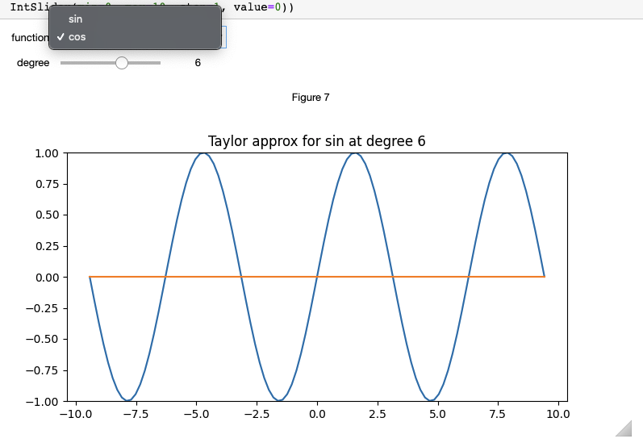

---
jupytext:
  cell_metadata_filter: all, -hidden, -heading_collapsed, -run_control, -trusted
  notebook_metadata_filter: all, -jupytext.text_representation.jupytext_version, -jupytext.text_representation.format_version,
    -language_info.version, -language_info.codemirror_mode.version, -language_info.codemirror_mode,
    -language_info.file_extension, -language_info.mimetype, -toc
  text_representation:
    extension: .md
    format_name: myst
kernelspec:
  display_name: Python 3 (ipykernel)
  language: python
  name: python3
language_info:
  name: python
  nbconvert_exporter: python
  pygments_lexer: ipython3
nbhosting:
  title: Taylor interactif
---

# Taylor (3/3) un dashboard

+++

On se propose d'approximer une fonction par la formule de Taylor

$$f_n(x) = \sum_{i=0}^{n}\frac{f^{(i)}(0).x^i}{i!}$$

```{code-cell} ipython3
# ! pip install autograd
import autograd.numpy as np
import matplotlib.pyplot as plt

from math import factorial
```

## un dashboard

+++

en application de ce qu'on a vu sur les notebooks interactifs, on peut s'amuser à fabriquer un dashboard qui permet
- d'afficher l'approximation de Taylor pour une fonction f passée en paramètre  
- et le dashboard permet de choisir le degré de l'approximation  
- avec le choix entre plusieurs fonctions, par exemple sinus, cosinus, et exponentielle...

````{admonition} modes disponibles

la solution à cet exercice est relativement différente, selon le mode de restitution choisi pour `matplotlib`; notamment il y a 

* `%matplotlib inline` qui est le mode par défaut, **très ancien** et pas du tout interactif (on ne peut pas agrandir, zoomer, etc... dans la figure); c'est plutôt plus simple à coder, mais le résultat est vraiment rustique du coup, bref c'est plutôt déconseillé d'inverstir dans cette voie

* `%matplotlib ipympl` qui semble, en 2022, être le mode à choisir pour des visus interactives, i.e. qui permettent d'agrandir la figure, et de zoomer dedans;  
c'est un synonyme de `%matplotlib widget`, mais je vous recommande plutôt `ipympl` parce que:
  * ce mode nécessite une installation supplémentaire, d'un module qui s'appelle, justement:
     ```shell
     pip install ipympl
     ```
  * et aussi si vous voulez visualiser vos rendus interactifs sous vs-code (à retester tout de même)
  * mnémotechnique: **IPY**thon **M**at**P**lot**L**ib

par contre, c'est dommage mais le mode interactif ne survit pas au passage à HTML... i.e. sur `readthedocs.io` les rendus restent statiques..
````

notre solution utilise ce dernier mode, pour quelques exemples voir <https://matplotlib.org/ipympl/examples/full-example.html>; cette page peut être utile aussi <https://kapernikov.com/ipywidgets-with-matplotlib/>

```{code-cell} ipython3
%matplotlib ipympl
```

ce qui change fondamentalement entre le premier mode (`inline`) et les deux autres, c'est que dans le premier cas, à chaque changement de réglage on repeint toute la figure; c'est pus facile à écrire, mais ça "flashe" du coup à chaque fois; dans les autres modèles au contraire, on a une figure affichée, et lorsqu'on change un paramètre on va seulement modifier un des morceaux de la figure

ici par exemple notre figure c'est principalement deux courbes (la fonction, et son approximation), plus les décorations (axes, titres, etc..) et au changement de paramètre on va changer seulement la courbe de l'approximation - et éventuellement le titre si on veut

+++

le but du jeu est d'obtenir un matplotlib interactif de ce genre



+++

***
